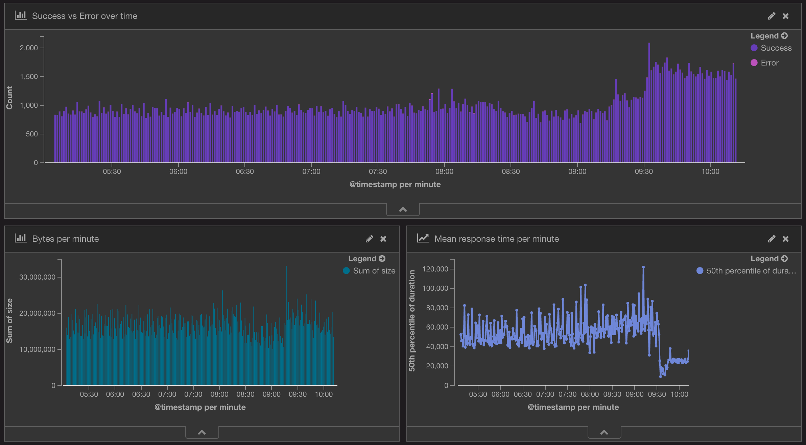

# Log Parsing with ELK

In order to run this demo you need to be on a mac and have docker toolbox installed: https://www.docker.com/docker-toolbox.

## Prerequisites

* Docker toolbox installed and Docker Virtual maching created and running - instructions available at http://docs.docker.com/mac/started/

## Assumptions

* Docker machine name is default

## How to use

Clone the repository and execute start.sh command:

```bash
git clone https://github.com/sponte/log-parsing
cd log-parsing
./start.sh
```

## What does **start.sh** do?

1. Downloads an image for ELK stack from docker hub
1. (Re)creates ELK container
1. Downloads sample apache log file
1. Downloads and extracts logstash
1. Configures Kibana with predefined searches, visualisations and dashboards
1. Parses and uploads access_log data using logstash to ELK
1. Opens up a default browser on a dashboard page \*

\* The page auto refreshes every 5 seconds, you will have to wait a bit to see the data.

## Result

If everything worked, you should see following dashboard after the data has been imported:


